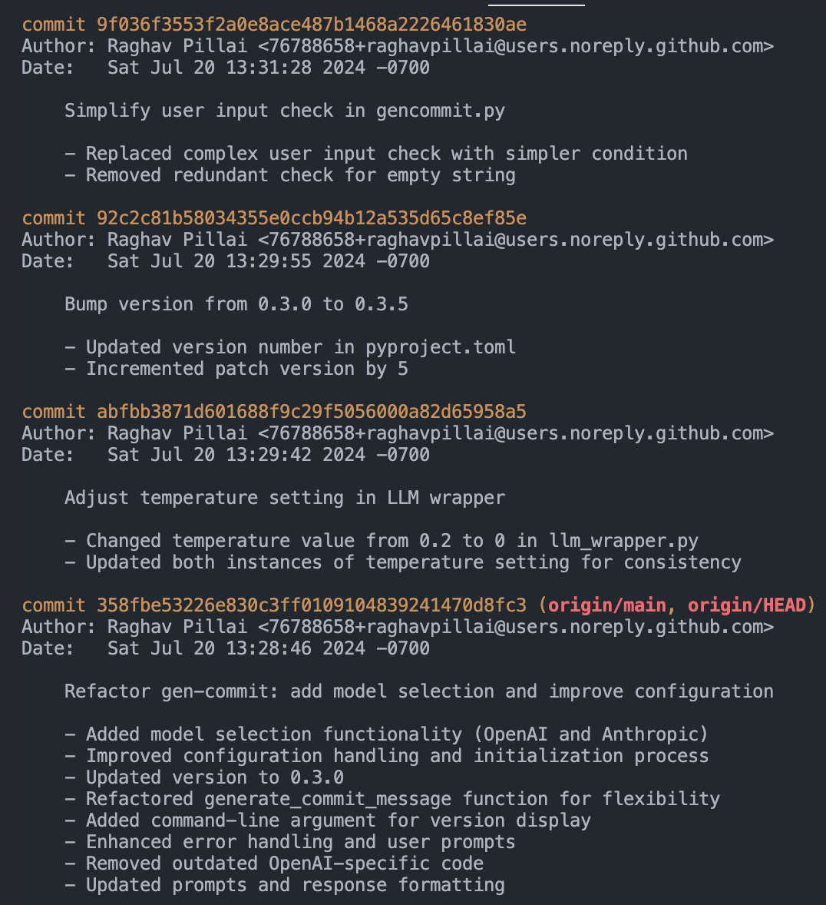

# Gen Commit

**Gen Commit** uses LLMs to automatically generate git commit messages. I'm lazy and don't like to write commit messages. Inspired by [scommit](https://github.com/Globe-Engineer/semantic-commit).

<p align="center">
  
</p>

---

## Usage

**gencommit** works exactly like git commit, but it generates the commit message and description for you.

```bash
gencommit
```

is the same as

```bash
git commit -m "..." -m "..."
```

but with a generated commit message.

You can also pass in the same arguments as git commit.

```bash
gencommit -a
```

is the same as

```bash
git commit -a -m "..." -m "..."
```

I recommend aliasing it, personally I alias it to `gc`. You can do this by adding the following to your shell configuration file (`.zshrc`, `.bashrc`, etc.)

```bash
alias gc="gencommit"
```

## Installation

### Recommended: Homebrew (macOS and Linux)

```bash
brew tap raghavpillai/gen-commit
brew install gen-commit
```

### Python

#### Prerequisites:

- Python 3.11+

Install the gen-commit package using pip:

```bash
pip install gen-commit
```

If you get

```bash
error: externally-managed-environment
```

This means Python now doesn't want you to install this as a system-wide package. You can install it using `pipx` or `venv`, or be lazy and install it via:

```bash
pip3 install gen-commit --break-system-packages
```

### Initialization

Once you have it installed, initialize gencommit

```bash
gencommit --init
```

Go to `~/.gen-commit` and add your OpenAI or Anthropic API key.

### Configuration

```bash
MODEL=<provider:model (i.e. openai:gpt-4o or anthropic:claude-3-haiku-20240307)>
OPENAI_API_KEY=<your openai api key>
ANTHROPIC_API_KEY=<your anthropic api key>
```

OPTIONAL:

```
MAX_LINE_LENGTH=<number>
MAX_TOKENS_ALLOWED=<number>
```

At the moment only OpenAI and Anthropic are supported.
